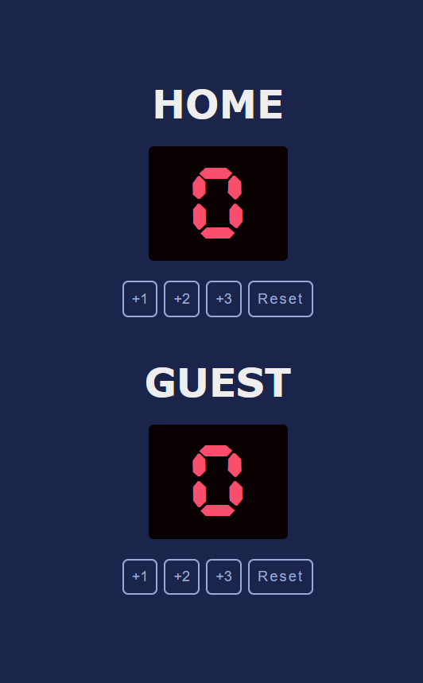

# Basketball Scoreboard App

Welcome to the Basketball Scoreboard App! This project was created as part of a Scrimba course to help users keep track of basketball scores during games.
## Features

- **Score Tracking**: Keep track of the score for two teams simultaneously.
- **Reset Functionality**: Reset the score, timer, and fouls with a single click.
- **Responsive Design**: The app is designed to work seamlessly on desktop and mobile devices.

## Technologies Used

- **HTML/CSS**: For the structure and styling of the app.
- **JavaScript**: To implement the functionality of the scoreboard and reset functionality.

## Project Link

The Basketball Scoreboard App is deployed and accessible at [https://basketball-scoreboard-ten.vercel.app/](https://basketball-scoreboard-ten.vercel.app/).

## Screenshots
*Screenshot 1: Scoreboard Interface on mobile screens*

*Screenshot 2: Scoreboard Interface on mobile screens*

